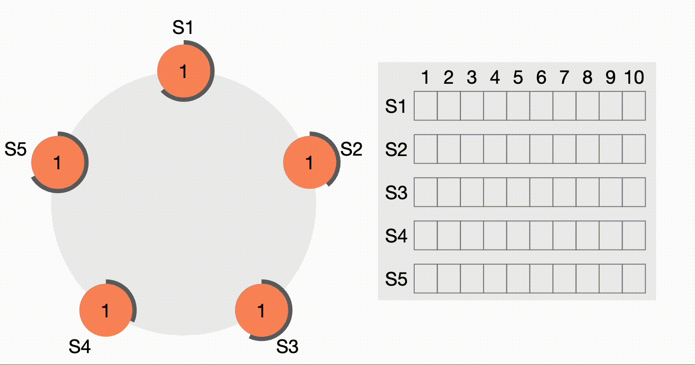

**MIT 6.824 Raft Lab**

**Lab2**
1. Part 2A: leader election
   * Implement Leader election and heartbeat detection functions.
     
2. Part 2B: log
   * Implement the log replication function of Leader and Follower.
3. Part 2C: persistence
   * Implement persistent storage and reading of Raft's key states.

4. Part 2D: log compaction
   * Implement functions such as log snapshot compression and installation snapshot.

**Lab3**
1. Part 3A
   * 正常场景，没有消息丢失和节点失效
   * 正常场景，没有消息丢失和节点失效
   * Server层需要处理Raft协商开始之后，commit之前leader发生变化的情况。由client向其他server发起重试。
2. Part 3B:快照
   * Apply之后需要判断log长度是否过长，过长则要执行snapshot
   * Server启动时执行restore流程，从snapshot中恢复出相关数据
   * Apply收到的是snapshot消息，则也要执行restore流程

...

[Lab instructions](http://nil.csail.mit.edu/6.824/2022/index.html)

[Raft Paper Original](http://nil.csail.mit.edu/6.824/2022/papers/raft-extended.pdf)

[Raft Paper Translation](https://github.com/maemual/raft-zh_cn/blob/master/raft-zh_cn.md)

[Raft Website](https://raft.github.io/)

[Lab Guide](https://thesquareplanet.com/blog/students-guide-to-raft/#applying-client-operations)